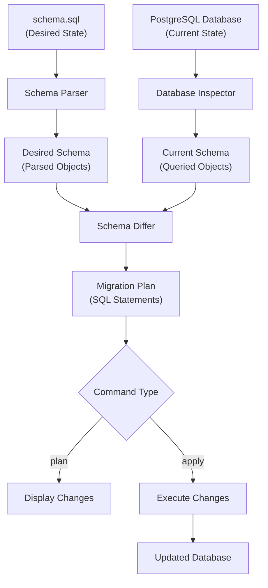
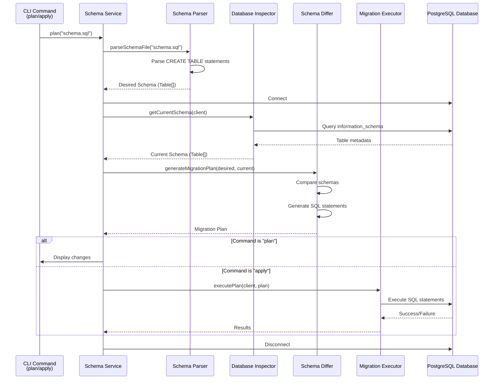
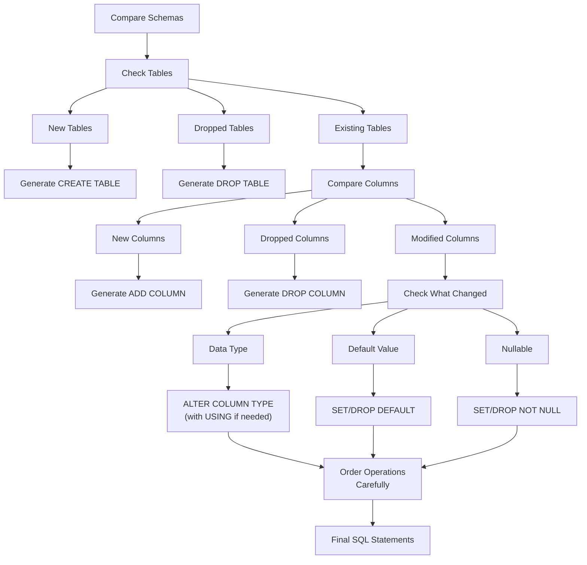
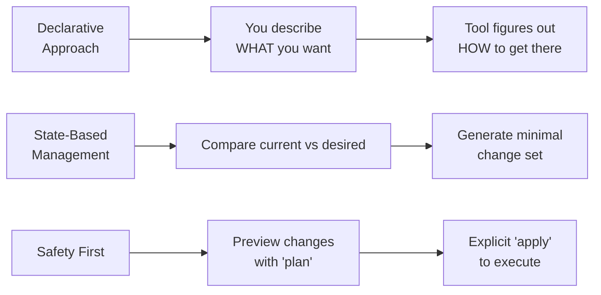

# PGTerra

A declarative Infrastructure as Code tool for PostgreSQL databases, similar to Terraform but specifically designed for database schema management.

## 🔍 Overview

PGTerra follows a declarative approach where you define your **desired database state** in a `schema.sql` file, and the tool automatically figures out what changes are needed to bring your database to that state. No more writing manual migration scripts - just describe what you want and let PGTerra handle the rest!

### Key Concepts

- **Declarative, Not Imperative**: You describe WHAT you want, not HOW to get there
- **State-Based Management**: Compare current vs desired state and generate minimal changes
- **Safety First**: Preview changes with `plan` before applying them
- **Idempotent Operations**: Running the same schema multiple times is safe

## 🏗️ How It Works



### Architecture Components

#### 1. **Schema Parser**

- Converts your `schema.sql` file into structured objects
- Uses `sql-parser-cst` for robust SQL parsing
- Handles CREATE TABLE statements with columns, constraints, and data types

#### 2. **Database Inspector**

- Queries the current database structure using PostgreSQL's `information_schema`
- Extracts table definitions, column details, constraints, and metadata
- Normalizes database state into the same format as parsed schema

#### 3. **Schema Differ**

- Compares desired vs current state
- Generates optimized migration plan with proper operation ordering
- Handles complex scenarios like type conversions, constraint changes, and data preservation

#### 4. **Migration Planner & Executor**

- Orchestrates the diffing process safely
- Executes SQL statements with proper error handling
- Provides detailed feedback on changes applied

## 🔄 Step-by-Step Process



## 📝 Simple Example

Let's walk through a simple example to see how PGTerra works:

### Starting Point: Empty Database

```sql
-- Database has no tables
```

### Define Desired State: `schema.sql`

```sql
CREATE TABLE users (
    id SERIAL PRIMARY KEY,
    email VARCHAR(255) NOT NULL,
    name VARCHAR(100) NOT NULL,
    created_at TIMESTAMP DEFAULT NOW()
);
```

### Run Plan Command

```bash
pgterra plan
```

**Output:**

```
📋 Analyzing schema changes...
📝 Found 1 change(s) to apply:

1. CREATE TABLE users (id SERIAL PRIMARY KEY, email VARCHAR(255) NOT NULL, name VARCHAR(100) NOT NULL, created_at TIMESTAMP DEFAULT NOW());
```

### Apply Changes

```bash
pgterra apply
```

**Result:** The `users` table is created in your database.

## 🔄 Schema Evolution Example

Now let's modify the existing table:

### Current Database State:

```sql
CREATE TABLE users (
    id SERIAL PRIMARY KEY,
    email VARCHAR(255) NOT NULL,
    name VARCHAR(100) NOT NULL,
    created_at TIMESTAMP DEFAULT NOW()
);
```

### Update Desired State: `schema.sql`

```sql
CREATE TABLE users (
    id SERIAL PRIMARY KEY,
    email VARCHAR(255) NOT NULL,
    full_name VARCHAR(200) NOT NULL,    -- renamed and expanded
    created_at TIMESTAMP DEFAULT NOW(),
    is_active BOOLEAN DEFAULT true      -- new column
);
```

### Generated Migration Plan:

```sql
ALTER TABLE users ADD COLUMN full_name VARCHAR(200) NOT NULL;
ALTER TABLE users ADD COLUMN is_active BOOLEAN DEFAULT true;
ALTER TABLE users DROP COLUMN name;
```

**PGTerra automatically:**

- Detected the new `full_name` column
- Added the new `is_active` column with default
- Removed the old `name` column
- Preserved all existing data

## 🛠️ Advanced Features

### Smart Type Conversions

When changing column types, PGTerra automatically handles complex conversions:

```sql
-- Before: age VARCHAR(10)
-- After:  age INTEGER

-- Generated migration:
ALTER TABLE users ALTER COLUMN age TYPE INTEGER USING age::INTEGER;
```

### Constraint Management

PGTerra intelligently handles constraint changes:

```mermaid
flowchart TD
    A["Column Modification"] --> B["Drop Conflicting Defaults"]
    B --> C["Change Data Type"]
    C --> D["Set New Default"]
    D --> E["Add/Drop NOT NULL"]

    F["Complex Example:"] --> G["VARCHAR → INTEGER<br/>with new DEFAULT"]
    G --> H["1. DROP DEFAULT"]
    H --> I["2. ALTER TYPE USING"]
    I --> J["3. SET DEFAULT"]
    J --> K["4. SET NOT NULL"]
```



### Operation Ordering

The differ carefully orders operations to avoid conflicts:

1. Drop conflicting defaults
2. Change data types (with USING clauses when needed)
3. Set new defaults
4. Modify NULL/NOT NULL constraints

## 🚀 Installation & Usage

### Prerequisites

- Node.js 18+ with Bun package manager
- PostgreSQL database
- Database connection configured

### Installation

```bash
bun install
```

### Commands

#### Plan Changes

Preview what changes would be made without applying them:

```bash
bun run cli plan
```

#### Apply Changes

Execute the planned changes:

```bash
bun run cli apply
```

#### Use Custom Schema File

```bash
bun run cli plan --file custom-schema.sql
bun run cli apply --file custom-schema.sql
```

### Configuration

Create a configuration file (e.g., `pgterra.config.json`):

```json
{
  "database": {
    "host": "localhost",
    "port": 5432,
    "database": "myapp",
    "username": "postgres",
    "password": "password"
  }
}
```

## 📁 Project Structure

```
pgterra/
├── src/
│   ├── cli/
│   │   └── commands/          # CLI command handlers
│   ├── core/
│   │   ├── database/          # Database connection & client
│   │   ├── migration/         # Migration planning & execution
│   │   └── schema/            # Schema parsing, inspection, diffing
│   ├── types/                 # TypeScript type definitions
│   └── utils/                 # Shared utilities
├── schema.sql                 # Your database schema definition
└── README.md
```

## 🔧 Technical Deep Dive

### Schema Differ Logic

The `SchemaDiffer` contains the most sophisticated logic:



### Data Structure

Tables and columns are represented as TypeScript interfaces:

```typescript
interface Column {
  name: string;
  type: string;
  nullable: boolean;
  default?: string;
  primary?: boolean;
}

interface Table {
  name: string;
  columns: Column[];
}
```

## 🎯 Design Principles



## 🚦 Current Status & Roadmap

### ✅ **Implemented Features**

#### **Core Table Operations**

- ✅ **Table Creation** - Create new tables from schema definitions
- ✅ **Table Dropping** - Remove tables not in desired schema
- ✅ **Mixed Table Operations** - Add, keep, and remove tables in single migration

#### **Column Management**

- ✅ **Column Addition** - Add new columns with various data types
- ✅ **Column Removal** - Remove columns while preserving data
- ✅ **Column Type Changes** - Convert between compatible data types
- ✅ **Default Values** - Handle columns with default values and constraints
- ✅ **Nullable Constraints** - Manage NOT NULL/NULL constraints

#### **Advanced Type Conversions**

- ✅ **String Type Conversions** - VARCHAR ↔ TEXT with length handling
- ✅ **Numeric Type Conversions** - INTEGER ↔ BIGINT, DECIMAL precision changes
- ✅ **Boolean Type Conversions** - All PostgreSQL boolean representations
- ✅ **Smart USING Clauses** - Automatic type conversion logic
- ✅ **Unicode Support** - Full Unicode, emoji, and multi-byte character handling

#### **Data Integrity & Safety**

- ✅ **Data Preservation** - All migrations preserve existing data
- ✅ **Operation Ordering** - Smart ordering to avoid constraint conflicts
- ✅ **Boundary Value Testing** - Edge cases for all data types
- ✅ **Large Dataset Support** - Performance-tested with large tables

#### **Performance & Reliability**

- ✅ **Performance Monitoring** - Benchmark tracking and regression detection
- ✅ **Concurrent Operations** - Lock management and concurrent access
- ✅ **Memory Efficiency** - Optimized for large datasets
- ✅ **Error Handling** - Graceful handling of edge cases and failures

#### **CLI & Tooling**

- ✅ **Plan Command** - Preview changes before applying
- ✅ **Apply Command** - Execute migrations safely
- ✅ **Schema File Support** - Custom schema file paths
- ✅ **Database Configuration** - Connection management
- ✅ **Comprehensive Testing** - 20+ test suites covering edge cases

#### **Primary Key Support**

- ✅ **Primary Key Detection** - Handles SERIAL PRIMARY KEY and composite keys
- ✅ **Composite Primary Keys** - Multi-column primary keys
- ✅ **Primary Key Changes** - Adding/removing/modifying primary keys

### 🔄 **In Progress**

#### **Core Schema Objects**

- [ ] **Indexes**
  - B-tree, GIN, GiST, BRIN, Hash indexes
  - Unique, partial, expression indexes
  - Concurrent creation and REINDEX operations
- [ ] **Advanced Constraints**
  - Foreign Keys with CASCADE/RESTRICT/SET NULL actions
  - Unique Constraints (multi-column)
  - Check Constraints with custom expressions
  - DEFERRABLE constraints

### 📋 **Planned Features**

#### **Advanced PostgreSQL Features**

- [ ] **Sequences**
  - Custom sequences with start/increment/min/max
  - Sequence ownership and dependencies
- [ ] **Views & Materialized Views**
  - Standard view creation and OR REPLACE
  - Materialized view management and refresh
- [ ] **Custom Types**
  - ENUMs with value management
  - Composite Types for complex data structures
  - Domain types with constraints

#### **Functions & Triggers**

- [ ] **Stored Functions/Procedures**
  - PL/pgSQL and SQL functions
  - Parameter and return type management
  - Function versioning (OR REPLACE)
- [ ] **Triggers**
  - BEFORE/AFTER/INSTEAD OF triggers
  - Row-level and statement-level triggers
  - Trigger enabling/disabling

#### **Database Administration**

- [ ] **Extensions**
  - Enable/disable PostgreSQL extensions
  - Extension version management
- [ ] **Roles & Security**
  - User and role management
  - Permission grants and revokes
  - Role membership hierarchy
- [ ] **Schema Namespaces**
  - Multi-schema support
  - Schema ownership and search paths
- [ ] **Tablespaces**
  - Custom tablespace management
  - Table and index tablespace assignment

#### **Enhanced Features**

- [ ] **Comments & Documentation**
  - Object-level comments and descriptions
  - Schema documentation generation
- [ ] **Advanced Rules**
  - Query rewrite rules
  - Rule creation and management
- [ ] **Event Triggers**
  - DDL event triggers
  - Database-level event handling

#### **Tooling & DevEx Improvements**

- [ ] **Configuration Management**
  - Multiple environment support
  - Configuration file formats (JSON/YAML)
- [ ] **Migration History**
  - Track applied migrations
  - Rollback capabilities
- [ ] **Schema Validation**
  - Pre-migration validation
  - Dependency checking
- [ ] **Import/Export**
  - Import from existing databases
  - Export current schema to files

### 📊 **Current Test Coverage**

The project has comprehensive test coverage with **20+ test suites** covering:

- **Table Operations**: 6 core scenarios
- **Column Operations**: 15+ test suites
- **Type Conversions**: String, Numeric, Boolean edge cases
- **Performance Testing**: Large datasets, concurrent operations
- **Unicode Support**: Emoji, multi-byte characters, escape sequences
- **Data Integrity**: Boundary values, NULL handling, constraint management

### 🎯 **Next Milestones**

**v0.2.0 - Primary Key & Index Support**

- Complete primary key constraint management
- Basic index creation and management
- Performance improvements for large schemas

**v0.3.0 - Foreign Keys & Advanced Constraints**

- Foreign key relationships with actions
- Unique and check constraints
- Constraint dependency resolution

**v0.4.0 - Views & Functions**

- Standard and materialized views
- Basic stored function support
- Enhanced schema validation
